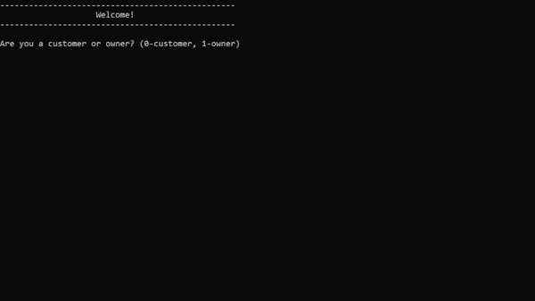
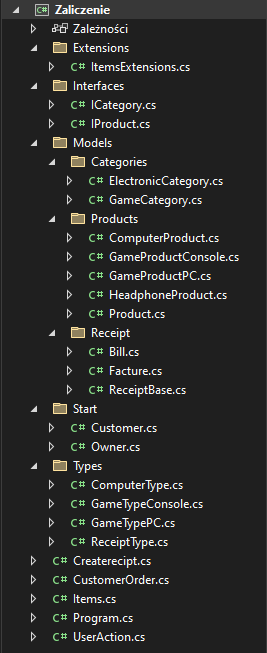

# Projekt zaliczeniowy "Sklep" - Programowanie Obiekotwe

## Opis
Projekt zaliczeniowy z przedmiotu Programowanie Obiektowe.
Aplikacja konsolowa pozwalająca na wyświetlanie: produktów w sklepie, tworzenie paragonu lub faktury, edytowania listy zakupów 
oraz z poziomu właściciela: edytowania asorymetu i sprawdzania rachunków. 

Aplikacja jest stworzona całwicie w c# wykorzystując platwormę .NET 6

Aplikację można sklonować (https://github.com/WojciechPestkaCDV/Projekt-Zaliczeniowy.git)

Dokumenctacja prjektu jest dostępna pod linkiem: (https://github.com/WojciechPestkaCDV/Projekt-Zaliczeniowy/wiki)

## Budowa Programu
Głównym plikiem aplikacji jest Program.cs

## Autorzy
* Wojtek Pestka
* Dawid Sekula
